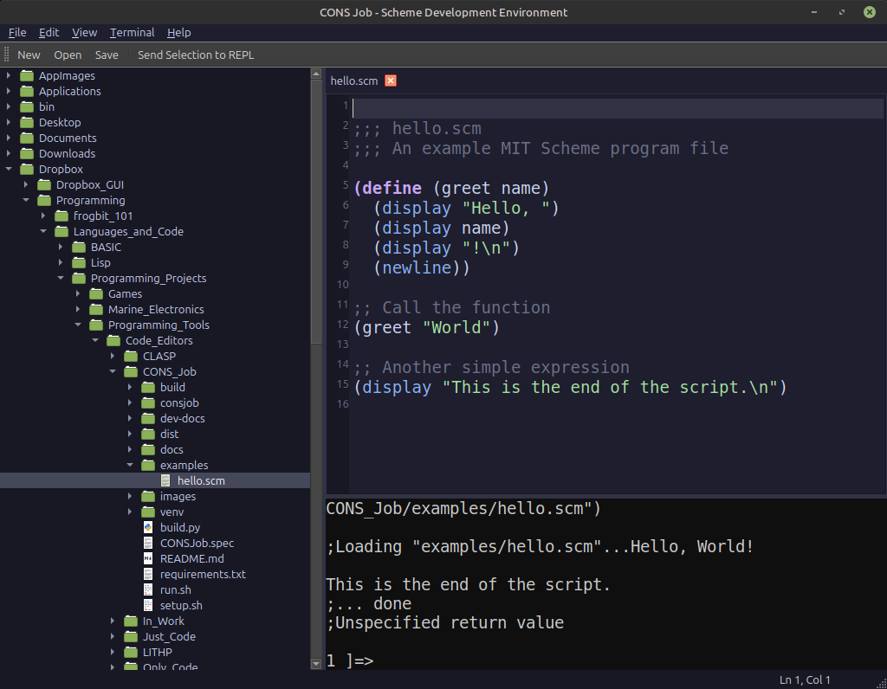

# CONS Job (Scheme Development Environment)



**CONS Job** is a beginner-friendly Integrated Development Environment (IDE) designed specifically for students and new programmers learning **Scheme**. Built with Python and PyQt6, it provides a modern, accessible interface with support for multiple Scheme interpreters including MIT Scheme, Guile, Chez Scheme, Chibi-Scheme, and more.

## ✨ Features

*   **Syntax Highlighting:** Clear color-coding for Scheme keywords, standard procedures, and data types.
*   **Parenthesis Matching:** Visual cues for matching parentheses to help navigate nested structures.
*   **Integrated REPL:** A built-in Terminal running your preferred Scheme interpreter for immediate code execution.
*   **Editor-to-REPL Workflow:** Seamlessly send code selections or files directly to the REPL with shortcuts (Ctrl+Enter, Ctrl+L).
*   **Project Navigation:** Integrated File Browser for managing your Scheme source files.
*   **Customization:** Switch between Dark and Light themes and configure editor preferences.
*   **Multi-Interpreter Support:** Automatically detects installed Scheme interpreters (MIT Scheme, Guile, Chez, Chibi, CHICKEN, etc.) with easy switching via Preferences.

## 🚀 Quick Start

### Prerequisites
*   **Linux, macOS, or Windows**
*   **Python 3.10+**
*   **A Scheme Interpreter** (one or more of the following):
    *   MIT/GNU Scheme: `sudo apt install mit-scheme` or `brew install mit-scheme`
    *   GNU Guile: `sudo apt install guile-3.0` or `brew install guile`
    *   Chez Scheme: `sudo apt install chezscheme` or `brew install chezscheme`

### Installation & Running

1.  **Clone the repository:**
    ```bash
    git clone https://github.com/yourusername/CONS-Job.git
    cd CONS-Job
    ```

2.  **Launch the Application:**
    Simply run the included script. It will automatically set up the virtual environment and dependencies for you.
    ```bash
    ./run.sh
    ```

### Building for Distribution

To create a standalone executable for your platform:

```bash
python3 build.py
```
The executable will be located in the `dist/CONSJob/` folder.

## 📖 Documentation

*   [**User Guide**](docs/USER-GUIDE.md): Detailed usage instructions.
*   [**Developer Changelog**](dev-docs/CHANGELOG-Master.md): History of changes and phases.

## 🛠️ Technology Stack

*   **Frontend:** Python 3.12, PyQt6
*   **Terminal Emulation:** `pyte`, `ptyprocess`
*   **Backend:** MIT Scheme (default), with support for Guile, Chez, Chibi, CHICKEN, and others

## 📜 License

(c) 2025 Chuck Finch - Fragillidae Software
